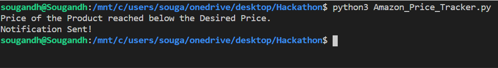

# Hackathon-Python

**#Amazon Price Tracker**

A python based project which tracks the price of an item on amazon and sends a notification on our phone when the price of the item drops below the desired price.
The code runs an infinite loop which breaks only when the price of the item drops below the desired price.
The function which checks the price drop runs after a specific amount of time(We have set it as 1 Hour).

This project tracks just one product at a time.(Which can be listed as one of its limitations)

Keeping track of price of products in the online sites isnt an easy task. So this project after further developments can turn out to be a great asset.
The same idea can further developed and be used to keep a track of stock market. Tracking the price of Bitcoin, Gold or even the drops and gains in share market.

**Screen Shots**

When the Price of the item reaches below your desired Price:

.png)
Notification on our phone

When the Price of the item is above your desired Price:

Code runs infinitey(Loops is executed again after specified time) and stops only when the price drops.
.png)
No Notification

**Installation and Running of the Program**

Before running the program you will need to install a few modules and a mobile app.

First open your command propt and install 3 modules by the following commands:

pip install beautifulsoup4
pip install requests
pip install pushbullet.py
(On Python3 use pip3)

Now you should install Pushbullet App on your phone and sign in to it(By your Google Account or any other means) and allow the app to show notifications.

Now open the the link of product you want to track on Amazon and copy its URL and initialise it to the **URL** variable defined as a global variable at the top of the program
Also set your desired price for the product you are tracking in the **desired_price** variable.

Now open site of pushbullet (https://www.pushbullet.com/) and sign in with the same account which you used to login on your phone. You will be able to see your phone on the devices tab.
Now go to Settings->Account.
There under the heading of Access Token you will see an option to "Create Access Token". Copy the generated token and initialize it to the **API_KEY** variable on the code.

Now just run the code on your terminal by python Amazon_Price_Tracker.py (or python3 Amazon_Price_Tracker.py)
The loop which checks the price runs every 60 mins. So the price is checked every hour and gives notification on phone if the price dropped. Else displays "Price of the Product is still more than the Desired Price." on your terminal.
